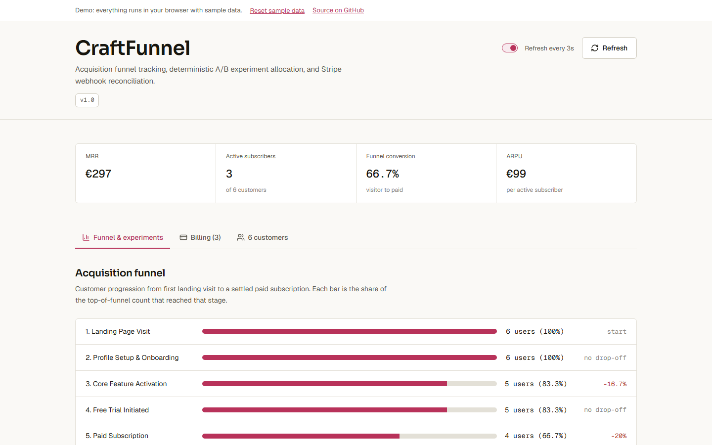
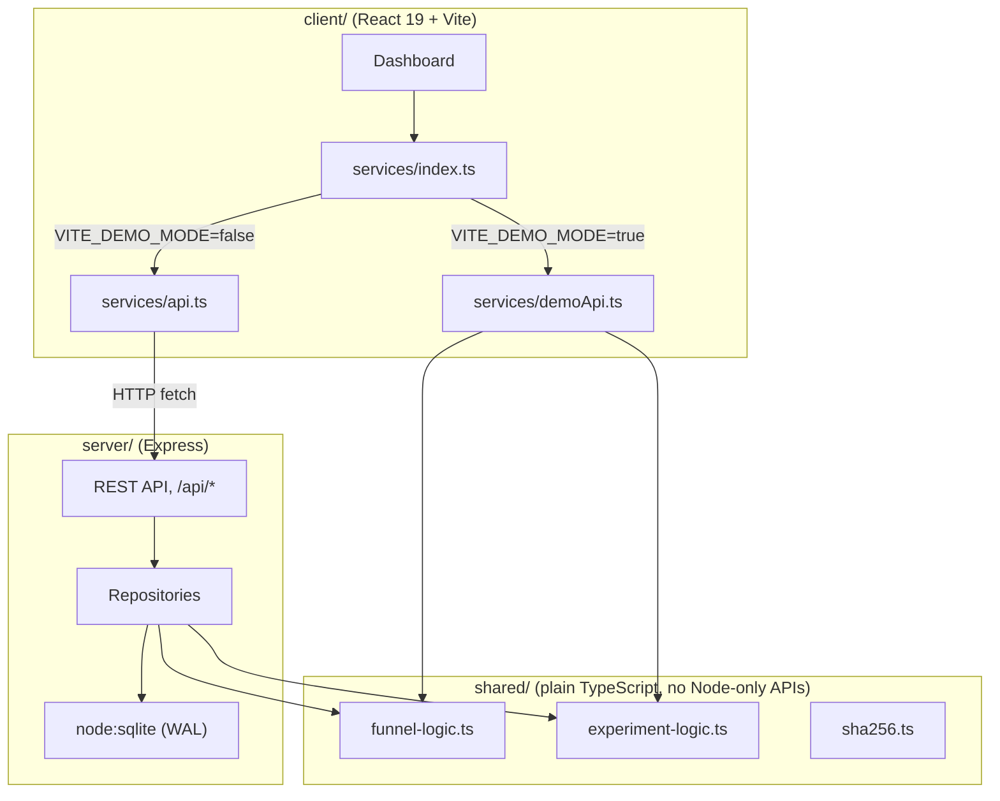

# CraftFunnel

CraftFunnel models a SaaS acquisition funnel end to end: it tracks customers through five lifecycle stages, runs deterministic A/B experiments with a two-proportion significance test, and reconciles Stripe-shaped payment webhooks into a ledger. It ships with a React dashboard for exploring the funnel, testing experiment variant assignment, and firing simulated webhooks by hand.

[](https://github.com/Taan1el/craftfunnel/actions/workflows/ci.yml)
[](https://github.com/Taan1el/craftfunnel/actions/workflows/pages.yml)
[](LICENSE)

**Live demo:** https://taan1el.github.io/craftfunnel/

The demo runs entirely in your browser: the same funnel and experiment math the server uses runs against fixed seed data instead of a real API, so it works with no backend. It resets to the seed data on every reload.

## Screenshots



The dashboard is a flat, light-paper interface: a stats strip up top, the acquisition funnel as a plain bar list with the
real count and conversion rate in mono type beside each stage, and A/B experiments as a dense list with a narrow "test a
user" column beside them. More screenshots: [Stripe webhook simulator and ledger](docs/screenshots/02-billing.png),
[customer directory](docs/screenshots/03-customers.png).

## Features

- **Acquisition funnel tracking**: five lifecycle stages (`visited` → `onboarded` → `activated` → `trial_started` → `converted_paid`), with per-stage conversion-from-first and drop-off-from-previous rates, and the highest-drop-off stage flagged as the priority experiment target.
- **Deterministic A/B experiment allocation**: a user is assigned to a variant by `SHA256(userId + ":" + experimentKey) mod 100` walked against the experiment's variant weights, so the same user always lands in the same variant without a database lookup, and the allocation is still recorded for conversion attribution.
- **Statistical significance**: a two-proportion Z-test between an experiment's control and treatment variant, reported once both have at least 10 visitors. The "statistically significant" flag and the confidence percentage use the same two-tailed 95% threshold (`|z| >= 1.96`), so they never disagree with each other.
- **Stripe-shaped webhook reconciliation**: `payment_intent.succeeded`, `invoice.payment_failed`, and `charge.refunded` events are recorded to a payment ledger, update customer MRR and status, and are deduplicated by event id so a retried webhook cannot double-charge. This models Stripe's webhook shape and idempotency pattern; it does not connect to a real Stripe account or verify webhook signatures.
- **Customer lifecycle inspector**: a per-customer drawer showing assigned experiment variants, funnel event history, and ledger transactions.
- **In-browser demo mode**: the GitHub Pages build reuses the exact funnel and experiment logic from `shared/` against fixed seed data, so it behaves like the real API with no backend.

## Getting started

### Prerequisites
- Node.js 22.5 or newer (built and tested on Node.js 24.14.1; `node:sqlite` needs 22.5+)
- npm 10 or newer (tested on npm 11.11.0)

### Install
```bash
git clone https://github.com/Taan1el/craftfunnel.git
cd craftfunnel
npm install
```

### Run
```bash
npm run dev
```
This starts the Express API on port 4000. Run the client in a second terminal:
```bash
npm run dev:client
```
Open **http://localhost:5173**.

### Environment variables

| Variable | Used by | Default | Purpose |
|---|---|---|---|
| `PORT` | server | `4000` | Port the Express API listens on. See `server/.env.example`. |
| `DB_PATH` | server | `./data/craftfunnel.db` | SQLite database file path. Use `:memory:` for a throwaway database (what the test suite uses). |
| `VITE_API_TARGET` | client (dev only) | `http://localhost:4000` | Where the Vite dev server proxies `/api` requests, for when the server runs on a different port. See `client/.env.example`. |

## Scripts

Run from the repo root unless noted otherwise.

| Script | What it does |
|---|---|
| `npm run dev` | Runs the Express server (`tsx watch`) |
| `npm run dev:client` | Runs the Vite dev server |
| `npm run build` | Builds the server, then the client, for production |
| `npm run build:pages` | Builds the client in demo mode (`client/dist`), for GitHub Pages |
| `npm test` | Runs the server test suite, then the client test suite |
| `npm run lint` | Typechecks the server, then the client (`tsc --noEmit`) |

## How it works

`shared/` holds the funnel and experiment math used by both the server and the browser demo: `funnel-logic.ts` (stage list, drop-off and conversion-rate calculation), `experiment-logic.ts` (deterministic variant allocation and the two-proportion significance test), `sha256.ts` (a dependency-free SHA-256 implementation so the browser demo hashes identically to Node's `crypto` module), and `format.ts` (shared rounding helpers). Neither the server's SQLite repositories nor the browser demo's in-memory store is part of `shared/`, since each reads from a different data source; both compute their final numbers by calling the same functions.



### Project layout

```
craftfunnel/
  client/                 React 19 + Vite dashboard
    src/components/       Header, StatsBar, FunnelVisualizer, ExperimentCards, WebhookSimulator, LedgerTable, CustomerDrawer, DemoBanner
    src/services/         api.ts (real), demoApi.ts (browser demo), demoData.ts (seed data), index.ts (the switch)
  server/                 Express API
    src/app.ts            Express app: CORS, JSON body parsing, API mount, static client build
    src/db/                SQLite schema, connection, and dev seed data
    src/controllers/      Request validation and response shaping
    src/services/         Business logic
    src/repositories/     SQL queries
    src/routes/            Route table
  shared/                 Funnel and experiment math used by both the server and the browser demo
  docs/adr/               Architecture decision records
  docs/screenshots/       README screenshots
```

## API reference

All routes are mounted under `/api`. Errors are always `{ "success": false, "error": "..." }`; successful responses are `{ "success": true, "data": ... }` except `/api/health` (no wrapper) and the two payment endpoints below (which return `reconciled`/`duplicate`/`ledger` fields alongside `success`, no `data`). Checked against `server/src/routes/*.ts` and `server/src/controllers/*.ts`.

| Method | Path | Body | Response data | Errors |
|---|---|---|---|---|
| GET | `/api/health` | - | `{ status, service, uptime, timestamp }` | - |
| GET | `/api/payments/metrics` | - | `GrowthMetrics` | 500 |
| GET | `/api/experiments` | - | `Experiment[]` (with `z_score`, `confidence_percentage`, `is_significant`) | 500 |
| POST | `/api/experiments/evaluate` | `{ experiment_key, user_id }` | `{ variant, isNew }` | 400 missing/invalid fields, 404 unknown experiment |
| POST | `/api/experiments/convert` | `{ experiment_key, user_id }` | `{ converted }` (`false` for an unknown experiment or user, not an error) | 400 missing/invalid fields |
| GET | `/api/funnel/metrics` | - | `FunnelStepMetric[]` | 500 |
| POST | `/api/funnel/track` | `{ customer_id, stage, metadata? }` | (none, 201) | 400 missing fields or unknown stage |
| POST | `/api/payments/webhook` | Stripe-shaped event: `{ id, type, data: { object } }` | `{ reconciled, duplicate?, message?, ledger? }` | 400 missing `id`/`type` |
| POST | `/api/payments/simulate` | `{ event_type?, customer_id, amount_cents?, idempotency_key? }` | `{ eventId, reconciled, duplicate, ledger }` | 400 missing `customer_id`, unsupported `event_type`, or non-positive `amount_cents` |
| GET | `/api/payments/ledger` | - | `PaymentLedgerEntry[]` (newest 50) | 500 |
| GET | `/api/customers` | - | `Customer[]` | 500 |
| GET | `/api/customers/:id` | - | `Customer` | 404 not found |
| GET | `/api/customers/:id/timeline` | - | `{ events, allocations, ledger }` | 404 not found |

A webhook naming a `customer` id or `customer_email` that does not match an existing customer is left `unhandled` (200, `reconciled: false`) rather than attributed to an arbitrary customer.

Shapes (`GrowthMetrics`, `Experiment`, `Variant`, `FunnelStepMetric`, `Customer`, `PaymentLedgerEntry`) are defined in `shared/types.ts`.

## Testing

- **Funnel and experiment math** (`server/test/funnel-logic.test.ts`, `server/test/experiment-logic.test.ts`): drop-off and conversion-rate rounding, an empty funnel, deterministic allocation cross-checked against Node's own `crypto.createHash`, and significance edge cases (below minimum sample size, zero variance, the confidence/significance threshold agreeing with each other).
- **API** (`server/test/api.test.ts`, via `supertest`): the happy path for every route, input validation (400s), 404s, that an unresolvable webhook is not attributed to an arbitrary customer, and empty-state metrics with no seed data.
- **Error handling** (`server/test/error.middleware.test.ts`): a deliberate 4xx `HttpError`'s own message reaches the client; anything else (including a 5xx `HttpError`) returns a generic message instead.
- **Client** (`client/src/test`, React Testing Library): dashboard rendering and tab switching, and the webhook simulator's empty state and client-side amount validation.
- **Demo adapter** (`client/src/test/demoApi.test.ts`): the seeded catalog, funnel and growth metrics, deterministic allocation and conversion, webhook reconciliation and idempotency, validation, and reset.

Run everything with `npm test` (or `npm run test:server` / `npm run test:client` separately).

## Deployment

### Docker
```bash
docker compose up --build
```
Serves the built client and API together at **http://localhost:4000**. Docker was not available while preparing this repository, so the image is only verified by the `docker` job in CI (`docker build`); if `docker compose up` does not work for you, please open an issue.

### GitHub Pages
`.github/workflows/pages.yml` runs `npm run build:pages` and publishes `client/dist` on every push to `master`. The deploy step is skipped while the repository is private and starts working once it is made public.

## Design notes and limitations

- There is no authentication on the API. Anyone who can reach it can read or write any funnel, experiment, or payment data. Do not expose this server to the public internet as-is.
- The Stripe webhook handling models the shape and idempotency pattern of real Stripe webhooks; it does not connect to an actual Stripe account, does not verify webhook signatures, and the "Fire Stripe Webhook" simulator accepts whatever the form sends.
- Significance testing is a standard two-proportion Z-test with a fixed 10-visitors-per-variant floor. It does not correct for peeking at results repeatedly, multiple comparisons, or sample ratio mismatch.
- SQLite is a single file used by a single server process; this is not built for multiple server instances sharing one database.
- The GitHub Pages demo's state lives only in the browser tab's memory. It is not persisted to localStorage, so it resets on every reload, and it is never shared between visitors.
- This has not had a security review. Treat it as a model of funnel analytics, experiment allocation, and payment reconciliation, not as a production billing or experimentation system.

## Roadmap

- Optional API key or basic auth for the mutating endpoints.
- Persist the GitHub Pages demo's state to localStorage across reloads.
- Cohort-based funnel breakdowns (by acquisition channel or signup week) instead of one aggregate funnel.
- Real Stripe webhook signature verification for anyone who wants to point a real Stripe account at this.

## License

MIT, see [LICENSE](LICENSE).
